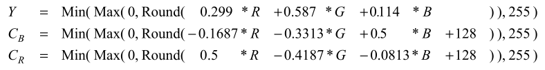
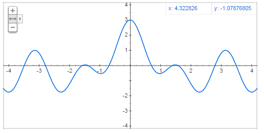
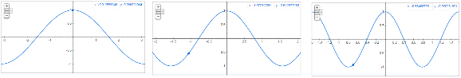
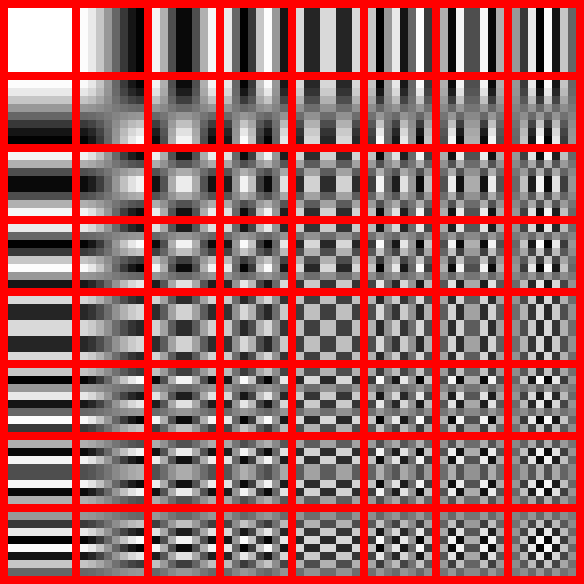
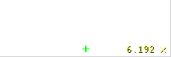
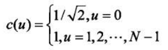
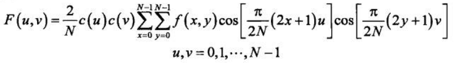
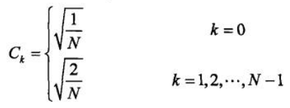
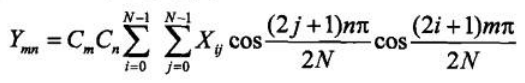
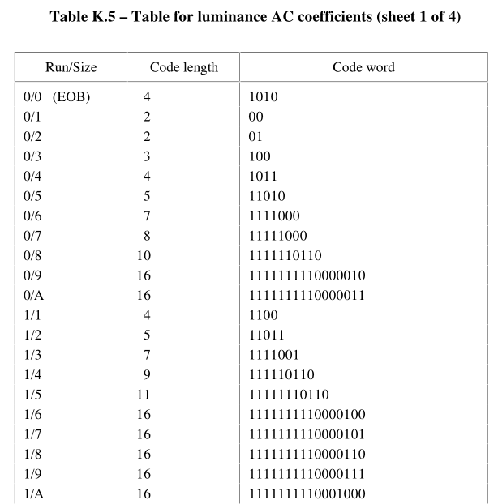

# 简介
以学习为目的编写的简易jpeg编码器，以看得懂为目标，代码尽可能清晰简洁，不对内存、性能做看不懂的优化，也不实现jpeg更多高级特性。

# JPEG 编码原理
网上相关的文章非常多，本文只挑重点进行解说

基本流程
色域转换 -> DCT变换 -> 量化 -> Huffman编码

## 色域转换
为什么要做色域转换？因为人眼的视杆细胞（对亮度敏感）的数量远多于视锥细胞（对颜色敏感），因此适当压缩颜色信息可以有效减少数据量。有关亮度和颜色的色域有YUV、HSL、HSV，为什么要用YUV？这个我真的不知道。

废话不多说了，这是整个JPEG编码过程中最简单的一个步骤，具体不详细展开了，网上相关内容太多了。
只说最重要的，色域的标准有BT601，BT656，BT709等，那么JPEG用的是哪一个？参考《ITU-T T.871》第7节“Conversion to and from RGB”，这里说的很清楚用的是BT601，但是和BT601有一点区别，BT601的YUV取值范围是16到235，JPEG中的取值范围是0到255。

书中给出的公式如下

如果在代码中使用这个公式转换色域最终编码出来的JPEG图片颜色会出问题
```
luma = 0.299f   * r + 0.587f  * g + 0.114f  * b;
cb   = -0.1687f * r - 0.3313f * g + 0.5f    * b + 128.0f;
cr   = 0.5f     * r - 0.4187f * g - 0.0813f * b + 128.0f;
```

使用这个公式才能得到正确的结果
```
luma = 0.299f   * r + 0.587f  * g + 0.114f  * b - 128;
cb   = -0.1687f * r - 0.3313f * g + 0.5f    * b;
cr   = 0.5f     * r - 0.4187f * g - 0.0813f * b;
```
查看 《ITU-T T.81》 的 A.3.1 节“Level shift”，这里提到数据需要 -2^(P-1) 的偏移，也就是说8位数据要减去128

## DCT变换
这里还是要稍微介绍一下DCT变换
DCT变换的关键是，它假设任何数字信号都可以用余弦函数的组合来重建。
如图所示,可以看到它实际上是 cos(x)+cos(2x)+cos(4x) 的和



将它扩展到二维就可以对图像进行处理。其思想是，任何8x8块可以表示为不同频率上加权余弦变换的和。

换句话说任何8*8的图像都可以由这64幅图像乘以不同的系数并叠加而得到。


如何得到这幅图像？
设Xij为一个8*8矩阵，其中ij表示行列下标
将第ij行列的元素置为1，其余元素置0，对得到这个矩阵进行DCT转换，就可得到对应的一个图像
重复上述过程直到完成全部64个元素对应的图像

来看这个实际演示，右边是原始图像，中间是原始图像乘以系数后的图像，左边是最终叠加的结果


想要了解有关DCT的更多知识或深入学习DCT原理请积极发挥主观能动性
这里直接给出二维DCT转换的公式


将C(u)前面的系数“2/N”乘进去可以得到


这两个公式是完全一样的，代码中用的是第二个公式

看不懂没关系，简单解释一下这几个符号：
* Ymn是DCT转换后第m行第n列的结果
* Xij是输入数据的第m行第n列的值
* Cm和Cn是系数
* N为DCT的大小，JPEG以8*8一块为单位进行处理
这个公式做的事情很简单，就是求和而已，据此我们可以写出一个非常原始且性能很差的DCT变换（4层循环啊！！性能有多差用这个代码压缩一张1920*1080就知道了）
```
#define DCT_SIZE 8

double ck(int32_t k)
{
    if (k == 0) {
        return sqrt(1.0 / DCT_SIZE);
    } else {
        return sqrt(2.0 / DCT_SIZE);
    }
}

void block_dct(const int8_t *in, double *out)
{
    int32_t i, j, n, m;
    double sum = 0.0;
    for (m = 0; m < DCT_SIZE; m++) {
        for (n = 0; n < DCT_SIZE; n++) {
            for (i = 0; i < DCT_SIZE; i++) {
                for (j = 0; j < DCT_SIZE; j++) {
                    sum += in[i * DCT_SIZE + j] * cos((2 * j + 1) * n * M_PI / (2 * DCT_SIZE)) * cos((2 * i + 1) * m * M_PI / (2 * DCT_SIZE));
                }
            }
            out[m * DCT_SIZE + n] =  sum * ck(m) * ck(n);
            sum = 0.0;
        }
    }
}
```
如果将这个DCT算法改为快速DCT算法，并将浮点运算改为整数运算，性能将得到大幅度提升，这不在本文讨论范围内。

## 量化
首先我们需要一个量化表，这是《ITU-T T.81》中的亮度分量量化表，JPEG的标准并没有规定一定要使用这个量化表，只不过大多数JPEG编码器都把这张表当做默认的量化表来用。
```
const uint8_t default_luma_table[] =
{
    16, 11, 10, 16,  24,  40,  51,  61,
    12, 12, 14, 19,  26,  58,  60,  55,
    14, 13, 16, 24,  40,  57,  69,  56,
    14, 17, 22, 29,  51,  87,  80,  62,
    18, 22, 37, 56,  68, 109, 103,  77,
    24, 35, 55, 64,  81, 104, 113,  92,
    49, 64, 78, 87, 103, 121, 120, 101,
    72, 92, 95, 98, 112, 100, 103,  99,
};
```
jpeg 有一个质量因数的参数，取值为1到100，其中1是最差，50为默认值，100为最好。
然后使用这个公式算出一个中间变量（这个公式的出处我暂时没要找到，但是有关JPEG编码的文章都会讲到这个公式）
```
if (qt < 50) {
    alpha = 50.0f / qt;
}
else {
    alpha = 2.0f - qt / 50.0f;
}
```
用 alpha 分别乘以上面量化表中的每一个成员并将结果限制在1-255范围之内，得到的就是终要使用的量化表。

有了量化表下一步进行量化，之前步骤中对数据的转化都是无损的，量化这一步才会真正导致图像数据损失
假设我们有这样一组亮度分量的数据
```
694 -169   1 -41  -9 -16 -10   4 
134 -37  -64  33 -11   2   5  -5 
  9  59  -15 -21  27   7  -4  -2 
 14   5   16 -20  -7   4   1   2 
  5   9    0   8 -11  19  20   6 
  8   5    6  -1   8 -12   3   8 
-18 -14  -14 -16 -21   1   3   1 
  3  -4   -7  -7  -8 -19  -6   8 
```
将亮度数据分别除以亮度量化表中的每一项，就会得到最终的量化结果
```
 43 -15   0  -3   0   0   0   0 
 11  -3  -5   2   0   0   0   0 
  1   5  -1  -1   1   0   0   0 
  1   0   1  -1   0   0   0   0 
  0   0   0   0   0   0   0   0 
  0   0   0   0   0   0   0   0 
  0   0   0   0   0   0   0   0 
  0   0   0   0   0   0   0   0 
```
在进行编码前的数据要进行Z字扫描，简单来说Z自扫描的目的是尽量将非0数据集中在一起，便于下一步的压缩，Z字扫描的顺序如图所示
***TODO图片***
这个步骤很简单，略过，最终的结果是这样的
```
 43 -15  11   1  -3   0  -3  -5 
  5   1   0   0  -1   2   0   0 
  0  -1   1   0   0   0   0   0 
 -1   1   0   0   0   0   0   0 
  0   0   0   0   0   0   0   0 
  0   0   0   0   0   0   0   0 
  0   0   0   0   0   0   0   0 
  0   0   0   0   0   0   0   0 
```

## 编码
JPEG 图像数据的编码分为两个部分，码字的长度编码和数值编码。其中对码字的长度编码才是要进行Huffman编码的部分，对数值编码只是一个简单的数学运算。
图像的数据基本都是由“编码后的码长+码字”组成的，假设码字为值为 1100011，码长为7，7对应的Huffman编码为 10，最终的数据是 101100011。

### 数值编码
数值编码的方法很简单，正数就是它本身，负数是它绝对值的反码，
正数的码长就是左起第一个不为0的位到结束的总位数，负数的码长就对应正数的码长，
例如
+123 = （补码）0x7B = 1111011 码长7
-123 = 绝对值的反码 = 0000100 码长7

### 构建Huffman编码树
JPEG中使用的Huffman编码并和平常所说的Huffman编码不同，而是范式Huffman编码（canonical Huffman code），Huffman编码和范式Huffman编码详细概念不再展开，下面重点将如何根据JPEG中的Huffman表构建Huffman编码树。

JPEG的标准并没有提供默认的Huffman编码表，实际编码时可以根据图像本身构建Huffman编码表来最大限度地压缩数据。只不过一般情况下大家都不会去构建编码表，而是直接拿这张表来用。
这是《ITU-T T.81》中的亮度交流分量Huffman码长度表，一共16个数据，从第一个到第十六个依次表示码长为N的Huffman码个数
```
const uint8_t default_ht_luma_ac_len[16] =
{
    0,2,1,3,3,2,4,3,5,5,4,4,0,0,1,0x7d
};
```
例如上面这张表就是说码长为1的编码有0个，码长为2的编码有2个，码长为3的编码有1个……码长为16的编码有125个，加起来一共有162个编码


这是《ITU-T T.81》中的亮度交流分量Huffman表，也就是Huffman编码前的数据
```
const uint8_t default_ht_luma_ac[162] =
{
    0x01, 0x02, 0x03, 0x00, 0x04, 0x11, 0x05, 0x12, 0x21, 0x31, 0x41, 0x06, 0x13, 0x51, 0x61, 0x07,
    0x22, 0x71, 0x14, 0x32, 0x81, 0x91, 0xA1, 0x08, 0x23, 0x42, 0xB1, 0xC1, 0x15, 0x52, 0xD1, 0xF0,
    0x24, 0x33, 0x62, 0x72, 0x82, 0x09, 0x0A, 0x16, 0x17, 0x18, 0x19, 0x1A, 0x25, 0x26, 0x27, 0x28,
    0x29, 0x2A, 0x34, 0x35, 0x36, 0x37, 0x38, 0x39, 0x3A, 0x43, 0x44, 0x45, 0x46, 0x47, 0x48, 0x49,
    0x4A, 0x53, 0x54, 0x55, 0x56, 0x57, 0x58, 0x59, 0x5A, 0x63, 0x64, 0x65, 0x66, 0x67, 0x68, 0x69,
    0x6A, 0x73, 0x74, 0x75, 0x76, 0x77, 0x78, 0x79, 0x7A, 0x83, 0x84, 0x85, 0x86, 0x87, 0x88, 0x89,
    0x8A, 0x92, 0x93, 0x94, 0x95, 0x96, 0x97, 0x98, 0x99, 0x9A, 0xA2, 0xA3, 0xA4, 0xA5, 0xA6, 0xA7,
    0xA8, 0xA9, 0xAA, 0xB2, 0xB3, 0xB4, 0xB5, 0xB6, 0xB7, 0xB8, 0xB9, 0xBA, 0xC2, 0xC3, 0xC4, 0xC5,
    0xC6, 0xC7, 0xC8, 0xC9, 0xCA, 0xD2, 0xD3, 0xD4, 0xD5, 0xD6, 0xD7, 0xD8, 0xD9, 0xDA, 0xE1, 0xE2,
    0xE3, 0xE4, 0xE5, 0xE6, 0xE7, 0xE8, 0xE9, 0xEA, 0xF1, 0xF2, 0xF3, 0xF4, 0xF5, 0xF6, 0xF7, 0xF8,
    0xF9, 0xFA
};
```

下面将如何构建Huffman编码树，网上很多文章都没能讲明白，看完还是一脸懵逼，我自己也花了很多精力才弄明白
流程是这样的：
* 建立根节点
* 为每一个节点建立两个分支，并标记为左0右1，同时树的高度（也就是码长）+1
* 如果当前高度有编码，则从树的最左边一个节点开始依次填写对应的码字，填写完成后剩余的节点创建新的分支
* 如果当前高度没有编码，则对其余的节点创建分支
* 重复上述过程，直到完成

按照这个流程我们用上面两张表来实际构建一个Huffman编码树
创建根节点，并创建两个分支，现在树的高度是1
```
  root
 /    \
0      1
```

由于没有码长为1的编码，需要为所有的子节点继续创建分支，现在树的高度是2
```
    root
   /    \
  0      1
 / \    / \
0   1  0   1
```

有1个码长为2的编码，从左到右填入码字
```
       root
    /        \
   0          1
 /   \       / \
0     1     0   1
0x01  0x02
```

为剩余的两个子节点继续创建分支，现在树的高度是3
```
         root
    /           \
   0             1
 /   \         /   \
0     1       0     1
0x01  0x02   / \   / \
            0   1 0   1
```

有1个码长为3的编码，从左到右填入码字
```
         root
    /            \
   0              1
 /   \          /   \
0     1        0     1
0x01  0x02   /   \   / \
            0     1 0   1
            0x03
```

剩余的三个子节点继续创建分支，现在树的高度是4
```
            root
    /                 \
   0                   1
 /   \           /           \
0     1         0             1
0x01  0x02   /     \        /    \
            0       1      0      1
            0x03   / \    / \    / \
                  0   1  0   1  0   1
```

有3个码长为4的编码，从左到右填入码字
```
             root
    /                    \
   0                      1
 /   \           /                 \
0     1         0                   1
0x01  0x02   /      \             /    \
            0        1           0      1
            0x03   /   \       /   \    / \
                  0     1     0     1  0   1
                  0x00  0x04  0x11
```

重复上述过程直到结束
从根节点依次遍历每一个叶子节点就可以得到每个码字对应的Huffman编码
结果如下
| Huffman编码 | 码字 |
| :---------- | :--- |
| 00b         | 0x01 |
| 01b         | 0x02 |
| 100b        | 0x03 |
| 1010b       | 0x00 |
| 1011b       | 0x04 |
| 1100b       | 0x11 |
可以对照《ITU-T T.81》中的表格来检验我们的编码结果是否正确


这样做的效率太低，实际不会用上面这种方式建立Huffman编码树并查询编码，而是用下面这种方法构建一张表，直接查表进行编码
建立的规则为：
1. 最小编码长度的第一个编码必须从0开始。
2. 相同长度编码必须是连续的。
3. 编码长度为 j 的第一个符号可以从编码长度为 j-1 的最后一个符号所得知，即 C[j] = 2 * (C[j-1] + 1)。
4. 如果没有长度为 j 的编码，则 C[j+1] = 2 * ((j+1)-(j-1)) * (C[j-1] + 1)，就是中间缺少了n个编码，就要再扩大2^n倍

以上述为例，最小长度为2，第一个编码从0开始，即00
长度为2的码有两个，相同长度编码必须连续，因此下一个是01
长度为3的第一个编码 = (长度为2的最后一个编码 + 1) * 2 即 (01 + 1) * 2 = 10 * 2 = 100
长度为4的第一个编码 = (长度为3的最后一个编码 + 1) * 2 即 (100 + 1) * 2 = 101 * 2 = 1010
长度为4的编码有三个，因此后两个是1011，1100

### Huffman编码
编码很简单，从编码树中查找对应的编码就行
这里说一下JPEG的编码规则
一般JPEG文件里面有4张Huffman编码表，分别是直流亮度编码表，直流色度编码表，交流亮度编码表，交流色度编码表
DCT转换并量化后的第一个数据是直流分量，使用直流编码表进行编码，其余的63个数据是交流分量，使用交流编码表进行编码
直流编码的数据是当前亮度直流分量与上一个亮度直流分量之差（或当前色度直流分量与上一个色度直流分量之差，色度只使用一张表，因此不区分是cb分量还是cr分量）
交流编码的数据为1字节，由两部分组成，高4位是连续0的个数，低4位是码长，其中有两个特殊码字，0x00(EOB end-of-block)在编码结束或其余数据都是0的时候使用，0xF0(ZRL)表示16个连续0，如果有32个连续0就写两个，以此类推。

以上文提到的亮度分量数据为例

直流数据编码
* 直流分量为43，上一个直流分量为0，差值为43
* 对43(0x2b)进行数值编码，结果为101011，码长6
* 查找亮度直流Huffman编码表，6对应的编码为1110
* 最终编码结果为1110101011
* 如果直流分量数值为0，则当做码长为0的编码，千万不要把它当成码长为1的编码

交流数据编码
* -15数值编码为0000，码长4
* 前面没有0，因此高4位填0，低4位填码长4，得到0x04
* 查找亮度交流Huffman编码表，0x04对应的编码为1011
* 最终编码结果为10110000
* 重复上述过程直到第26个数据，之后全是0，因此编码结束，在第26个数据后面填写EOB，也就是1010

完成亮度数据编码后再进行色度数据编码，完成这一个8*8块的所有编码后再进行下一块，直到图像结束，至此就完成了全部的编码工作。


# JPEG 文件格式
相关文章有很多，这里给出一篇供参考，如果有不理解的地方配合 JPEGsnoop 实际看几张JPEG图片
https://www.cnblogs.com/sddai/p/5666924.html
最后格式要求把数据写入文件，这样一张JPEG图片就完成了。
需要注意的是，0xFFDB字段保存的量化表是Z字扫描后的量化表，不是原始量化表。（这一点我暂时没有找到相关的说明文章）
一般app0用来保存JFIF，app1用的保存exif，其余的自定义
实际发现软件通过查找appx里面的前几个字节是jfif还是exif来判断它的具体内容


# 参考资料
T.81 Information technology - Digital compression and coding of continuous-tone still images - Requirements and guidelines
https://www.itu.int/rec/T-REC-T.81/en
https://www.w3.org/Graphics/JPEG/itu-t81.pdf

T.871 : Information technology - Digital compression and coding of continuous-tone still images: JPEG File Interchange Format (JFIF)
https://www.itu.int/rec/T-REC-T.871

JPEG wiki
https://en.wikipedia.org/wiki/JPEG

JPEG文件头标记
https://www.cnblogs.com/sddai/p/5666924.html

其他参考资料
https://www.freecodecamp.org/news/how-jpg-works-a4dbd2316f35/#.2l56xw83s
https://www.cnblogs.com/Arvin-JIN/p/9133745.html
https://zhuanlan.zhihu.com/p/72044095
https://calendar.perfplanet.com/2015/why-arent-your-images-using-chroma-subsampling/

这个视频也讲得非常好
https://www.bilibili.com/video/BV1Nr4y1S76N

这两篇文章讲的非常好，也是我的主要参考依据
https://www.impulseadventure.com/photo/jpeg-huffman-coding.html
https://www.impulseadventure.com/photo/jpeg-compression.html

JPEGsnoop  (JPEG分析工具)
https://www.impulseadventure.com/photo/jpeg-snoop.html
